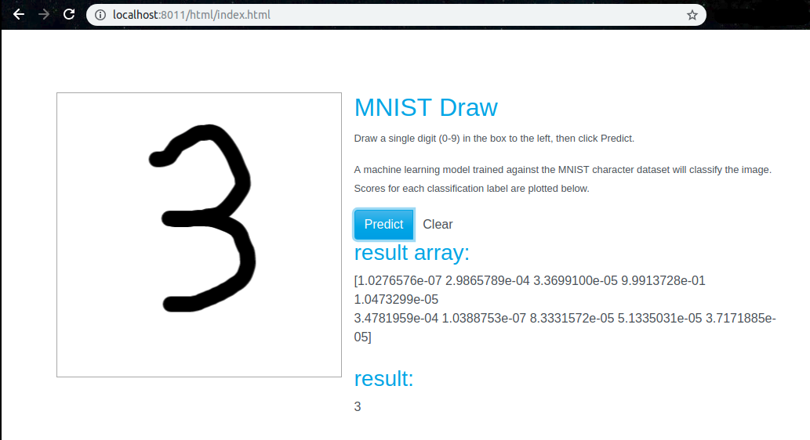

# mnist-web  
mnist online demo  

# install  
requer: python3.6.7  
replace the first line of cgi-bin/mnist.py 
> git clone https://github.com/hcen1997/mnist-web.git  
> cd mnist-web  
> python3 -m http.server --bind localhost --cgi 8011  

# demo  

